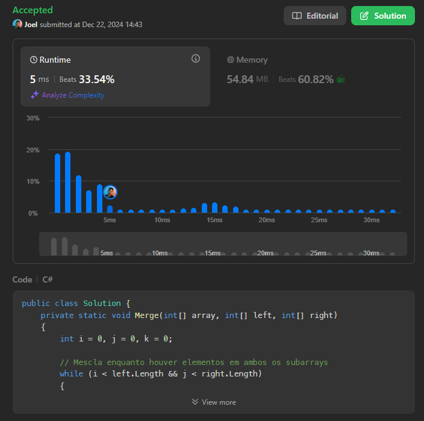

# 4. Median of Two Sorted Arrays

[Link da Questão: 4. Median of Two Sorted Arrays](https://leetcode.com/problems/median-of-two-sorted-arrays/)

- Nível do problema: **Hard**
- Linguagem Utilizada: **C#**

## Resultados do Juiz Eletrônico

Submissão 1

## Resumo

- O problema consistia em, dado dois vetores previamente ordenados *nums1* e *nums2*, de tamanhos m e n, respectivamente, o programa deverá retornar a mediana deles.
- A complexidade esperada do código deveria ser $O(\log (m+n))$.

## [Solução](4-Median-of-Two-Sorted-Arrays.cs)

### Submissão 1
- Para solucionar o problema, foi utilizado a função de merge do mergesort para juntar os vetores ordenados e depois foi feito um cálculo simples para encontrar a mediana.