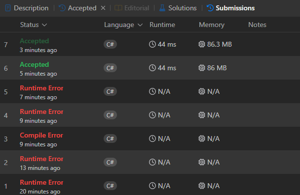
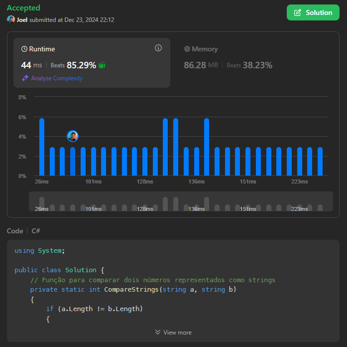

# 1985. Find the Kth Largest Integer in the Array

[Link da Questão: 1985. Find the Kth Largest Integer in the Array](https://leetcode.com/problems/find-the-kth-largest-integer-in-the-array/description/)

- Nível do problema: **Medium**
- Linguagem Utilizada: **C#**

## Resultados do Juiz Eletrônico

Submissões

Submissão final

## Resumo

- O problema consistia em, dado um array de strings *nums* e um inteiro k, onde cada string em nums representa um número inteiro sem zeros à esquerda, o programa deverá retornar a string que representa o k-ésimo maior número inteiro em nums.
- Números duplicados devem ser contados distintamente. Por exemplo, se *nums* for ["1", "2", "2"], "2" é o maior número, "2" novamente é o segundo maior número, e "1" é o terceiro maior número.
- A complexidade esperada do código deveria ser $O(n)$.

## [Solução](1985-Kth-Largest-Number.cs)

### Submissão 1
- Para solucionar o problema, foi utilizado o algoritmo de mediana das medianas, o que garantiria a complexidade linear nesse problema. 
- O algoritmo mediana das medianas foi adaptado para conseguir fazer comparações entre as strings através de uma outra função "CompareStrings".