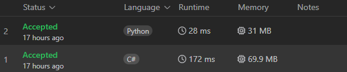
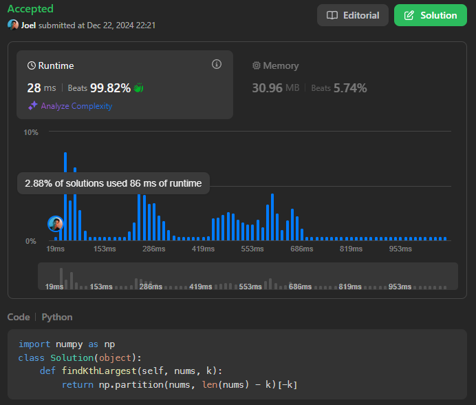
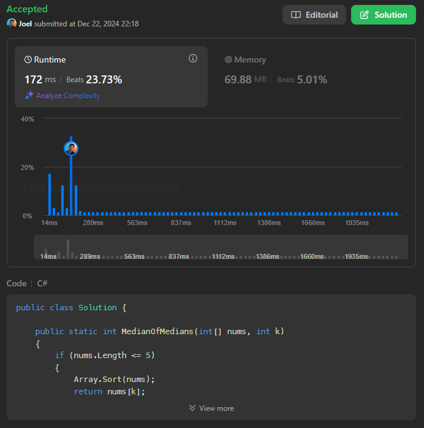

# 215. Kth Largest Element in an Array

[Link da Questão 215](https://leetcode.com/problems/kth-largest-element-in-an-array/description/)

- Nível do problema: **Medium**
- Linguagem Utilizada: **C# e Python**

## Resultados do Juiz Eletrônico

Submissões

Submissão em Python

Submissão em C#

## Resumo

- O problema consistia em, dado um vetor *nums*, encontrar o k-ésimo maior elemento (essa posição leva em consideração o vetor ordenado.)
- A complexidade esperada do código deveria ser $O(n)$.

## Soluções: [C#](215-Find-Kth-Largest.cs) e [Python](215-Fin-Kth-Largest.py)

### Submissão em C#
- Para solucionar o problema, foi utilizado o algoritmo de mediana das medianas, o que garantiria a complexidade linear nesse problema. 

### Submissão em python
- Em python, com a finalidade de comparar uma biblioteca que já possuia seus algoritmos bem definidos e otimizados com o algoritmo de mediana das medianas aplicado em C#, foi utilizado a função *partition* do *Numpy*. Esse método organiza o array de forma parcial, movendo o 
𝑘-ésimo maior elemento para a posição correta, mas sem ordenar os outros elementos. A complexidade média é 𝑂(𝑛), mas o pior caso pode ser 𝑂(𝑛²) dependendo da escolha do pivô (geralmente aleatório)