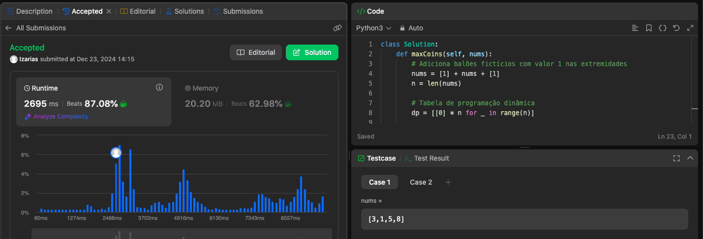

# 312. Burst Balloons

[Link da Questão: 312. Burst Balloons](https://leetcode.com/problems/burst-balloons/)

- Nível do problema: **Hard**
- Linguagem Utilizada: **Python**

## Resultados do Juiz Eletrônico

Submissão 1

## Resumo

- O problema consiste em estourar balões dispostos em uma linha de forma a maximizar o número de moedas obtidas. A cada vez que um balão é estourado, você ganha moedas, que são calculadas multiplicando o valor do balão com os balões vizinhos (à esquerda e à direita).
- O objetivo foi implementar uma solução utilizando a abordagem de **Programação Dinâmica**, garantindo uma complexidade de $O(n^3)$.

## [Solução](312-burst-balloons.py)

### Submissão 1
- A solução começou com a adição de balões fictícios com valor 1 nas extremidades da lista de balões para simplificar os cálculos.
- Utilizou-se uma tabela de programação dinâmica `dp` para armazenar a solução de subproblemas menores, onde `dp[left][right]` armazenava o número máximo de moedas que poderiam ser ganhas ao estourar todos os balões entre as posições `left` e `right`.
- A solução foi preenchendo a tabela para todos os intervalos de balões possíveis, calculando as moedas ganhas ao estourar cada balão em cada intervalo e utilizando resultados de subproblemas anteriores.
- Ao final, o valor `dp[0][n-1]` continha o número máximo de moedas que poderiam ser obtidas estourando todos os balões.

