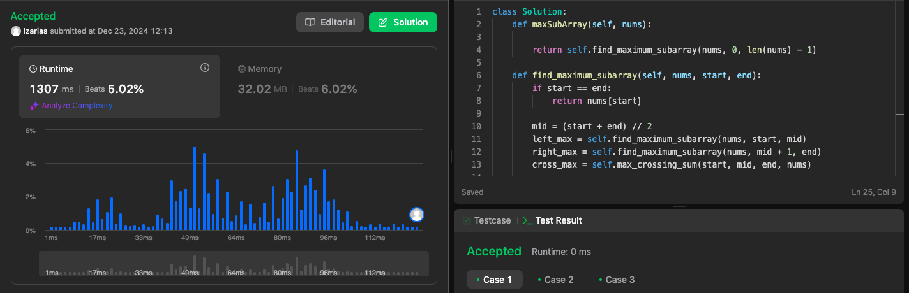

# 53. Maximum Subarray

[Link da Questão: 53. Maximum Subarray](https://leetcode.com/problems/maximum-subarray/)

- Nível do problema: **Medium**
- Linguagem Utilizada: **Python**

## Resultados do Juiz Eletrônico

Submissão 1

## Resumo

- O problema consiste em encontrar a soma máxima de um subarray contínuo dado um array de inteiros *nums*.
- O objetivo foi implementar uma solução utilizando a abordagem de **Dividir e Conquistar**, garantindo uma complexidade de $O(n \log n)$.

## [Solução](53-Maximum-Subarray.py)

### Submissão 1
- A solução dividiu o array em partes menores, calculando:
  1. A soma máxima do subarray na metade esquerda.
  2. A soma máxima do subarray na metade direita.
  3. A soma máxima de um subarray que cruza o meio.
- O resultado foi obtido combinando esses valores, utilizando recursão e somas acumuladas.
